# 손명기

- Email: audrl1010@naver.com
- Github: https://github.com/audrl1010
- Blog: https://medium.com/@audrl1010

 

## 경력사항

### 레벨 13
- 기간: 2021.08 ~ 현재
- 내용: 국내 최초 남자 쇼핑 플랫폼 룩핀 e-commerce 서비스 iOS 개발

### 핀다
- 기간: 2021.05 ~ 2021.08
- 내용: 핀다 핀테크 서비스 iOS 개발

### 뷰링

- 기간: 2020.05 ~ 2021.05
- 내용: 볼터치 동영상 리뷰 e-commerce 서비스 iOS 개발

### 누림

- 기간: 2019.06 ~ 2020.05
- 내용: iOS, React Native 개발 및 서비스

### 셀리

- 기간: 2018.04 ~ 2019.06
- 내용: iOS 개발 및 서비스

### 그루기술

- 기간: 2017.02 ~ 2018.02
- 내용: iOS 개발 및 서비스

 

## 회사 프로젝트

### 룩핀
- 소개: 국내 최초 남자 쇼핑 플랫폼 (유저 600만)
- 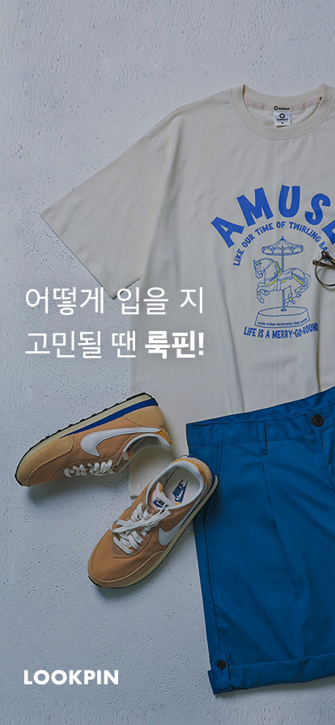 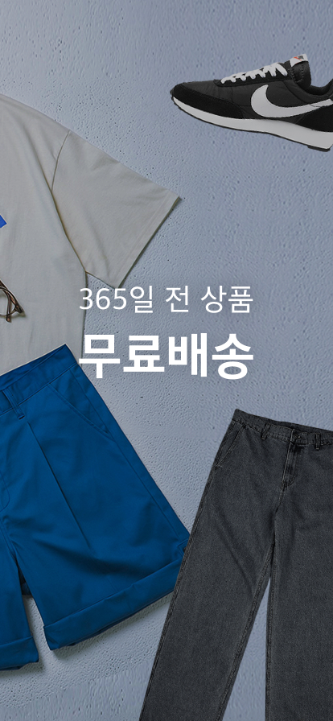 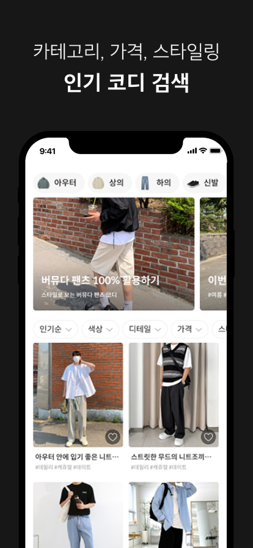 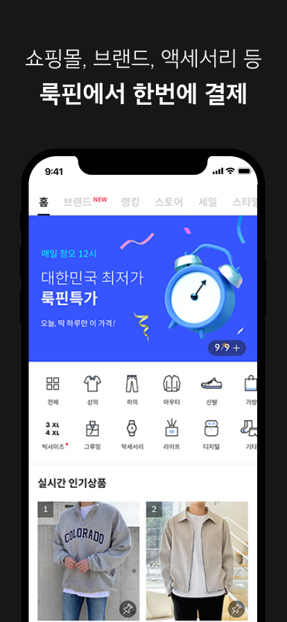 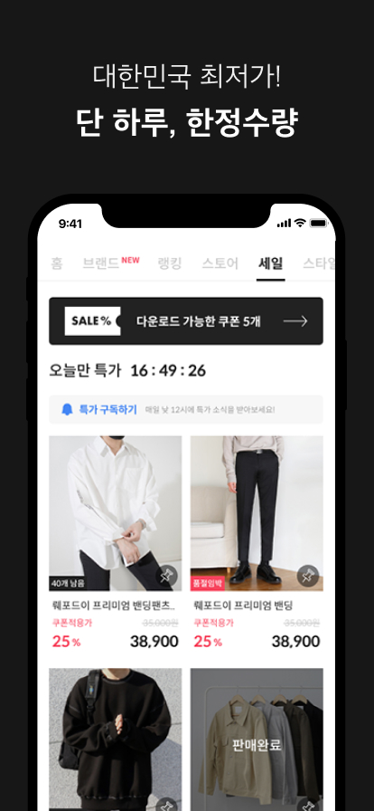 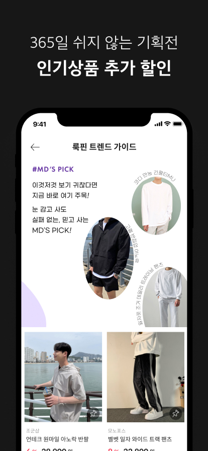 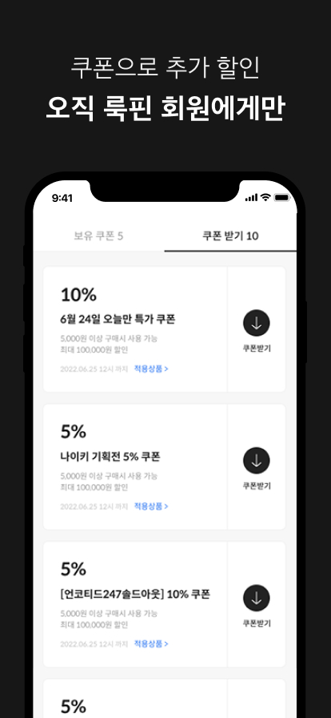
- 소속: 레벨 13
- 기간: 2021.08 ~ 현재
- 역할: iOS 개발
- 개발환경: Xcode
- 사용기술: Swift, RxSwift, RIB, ReactorKit, Firebase, Xcodegen
- 대표 수행 업무:
  - 아키텍처 개선 (기존 MVC -> RIB 변환) (2021.08 ~)
    - 현재 MVC -> RIBs로 80% 가량 변경

  - github action CI CD 구축 (2022.09.06 ~ 09.24)
    - 기존 인증서 관리를 fastlane match로 변경
    - github action + fastlane을 통해 firebase app 배포, appstore 배포 구축
    - 평균 1회 배포당 개발자 10분 생산성 향상(20회 배포 시 200분 가량 벌 수 있음)
    
  - 코디 옴니어스 필터 개발 (2022.07.15 ~ 09.01)
    - 색상 필터, 디테일 필터 개발
    - 유저 리텐션 10% 향상
    
  - 상품 상세 페이지 연관 코디 영역 추가 (2022.07.01 ~ 07.14)
    - 코디 영역 개발 
    - 코디 트래픽 15% 증가 구매 전환율 5% 상승

  - 브랜드 텝 신설 (2022.06.09. ~ 06.24)
    - 브랜드 이벤트 배너, 인기 브랜드 영역, 상품 카테고리 영역, 키워드별 추천 영역, 기획전 상품 영역, 브랜드 랭킹(상품 텝, 스토어 텝) 영역 RIBs로 구현
  
  - 상품 상세 리팩토링 (2022.05.16 ~ 06.09)
    - 유지보수 하기 정말 어려운 구조(MVC)를 유지보수 용이한 구조(RIBs)로 변경
    - RIBs 변경 하면서 불필요한 렌더링 최소화 처리로 렌더링 속도 개선 약 20% 성능 향상
    - 상품 상세 기능 추가 수정 요청이 많은 편이여서, 기존 레거시에 비해 기능 추가 수정 하는 비용이 기존 대비 40%가량 향상

  - 채널톡 아날리틱스 추가 (2022.04.18 ~ 05.16)
    - 다양한 푸시 활용 방안을 위해 채널톡 SDK event tracking 추가
  
  - 코디 상세 고도화 (2022.04.05 ~ 04.18)
    - 기존 MVC -> RIBs 아키텍처 변경
    - 함께 본 코디 개발
    - 해당 스토어 인기 코디 개발
  
  - 인기 코디 조합 영역 및 코디 필터 고도화 (2022.03.14 ~ 03.28)
    - 인기 코디 조합 영역 개발
    - 코디 필터 가격 포맷터 개발

  - 앱스플라이어(마케팅툴) -> 에어브릿지(마케팅툴) 변경 (2022.02.11 ~ 03.12)
    - 기존에 사용하던 앱스플라이어 도구에서 에어브릿지로 변경 작업
  
  - ABTest - 홈 메뉴 추가 (2022.02.09 ~ 02.11)
    - 파이어베이스 ABTest 홈 메뉴 개발
   
  - 스토어 상세 개편 (2022.01.13 ~ 02.03)
    - 각 브랜드/쇼핑몰별 콘텐츠, 추천 상품을 제공함으로써 볼거리 제공 - 스토어 상세 트래픽 확보
    - 스토어 상세 상품 텝, 코디 텝, 스토어 텝, 추천 상품 영역, 스티키 헤더 개발

  - 통합 검색 개편 (2021.12.27 ~ 2022.01.05)
    - 기존 통합 검색 UI/UX 불편, 상품/코디/스토어 텝간 이동 불가로 인해 개편
    - 통합 검색 상품 텝, 코디 텝, 스토어 텝 개발

  - 홈 개편 (2021.11.18 ~ 12.18)
    - 카테고리 브랜드 확장 영역 개발

  - xcode 프로젝트 환경 파일로인한 git 충돌 있슈 -> xcodegen 도입으로 해결 (2021.11.15 ~ 11.17)
    - 매주 배포 시 xcode 환경 파일에 의해 git brand 합치는 과정에서 merge 충돌 해결을 위해 투입되는 시간이 40분 정도의 비효율적인 시간(한달이면 40분 * 4 = 160분)이 걸리는 것을 파악한 후 xcode가 자동으로 만들어주는 환경파일을 xcode에 맡기지 않고 xcodegen을 통해 생성 시키므로써 프로젝트 환경 파일에 따른 git merge 충돌 시에 걸렸던 시간을 제거하여 생산성을 높임

  - 유저 데이터 추적을 위한 log 심는 작업 (2021.11.06 ~ 11.14)
    - 내부 트래킹 전용 API를 이용한 유저 데이터 트래킹 로그 심는 개발
    - 유저 데이터를 추적하여 정확한 매출 및 의미 있고 개선할 수 있는 데이터 분석을 가능 목적
  
  - 카테고리 상세 페이지에 연관 검색 키워드 추가 작업 (2021.11.03 ~ 11.05)
    - 하위 카테고리에 연관 키워드 추천 리스트 개발
    - 유저 구매 3% 증진

  - 코디 태그 개선 (2021.10.18 ~ 11.06)
    - 코디 태그 개선 개발
  
  - 상품 상세 페이지 속도 개선 (2021.09.24 ~ 09.26)
    - 기존에 상품 상세에 들어오기 전에 상품 상세 API 콜이 완료 된 후 상품 상세에 들어옴에 따라 유저의 네트워크 환경에 따라 상품 상세에 들어오기전에 지치는 상황이 발생, 상품 상세 페이지에 먼저 들어온 뒤에 API콜 하는 순으로 변경하여 유저가 상품 상세에 들어오기전에 기다리는 시간을 없앰, 유저 리텐션이 상당히 증가
- [해당 앱 스토어에서 보기](https://apps.apple.com/kr/app/%EB%A3%A9%ED%95%80-400%EB%A7%8C-%EB%82%A8%EC%9E%90%EB%93%A4%EC%9D%98-%ED%8E%B8%EC%A7%91%EC%83%B5/id1102358106#?platform=iphone)

### 핀다

- 소개: 핀테크 서비스 (연 200조 대출)
-  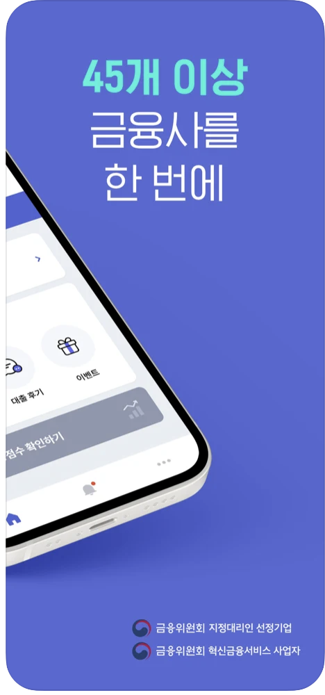 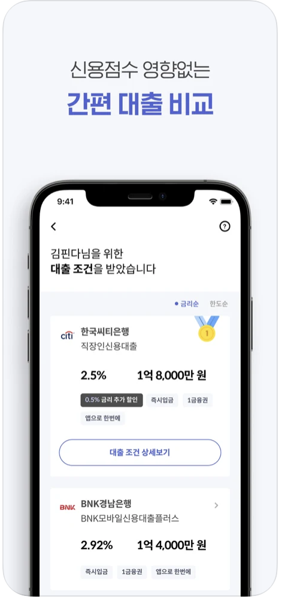 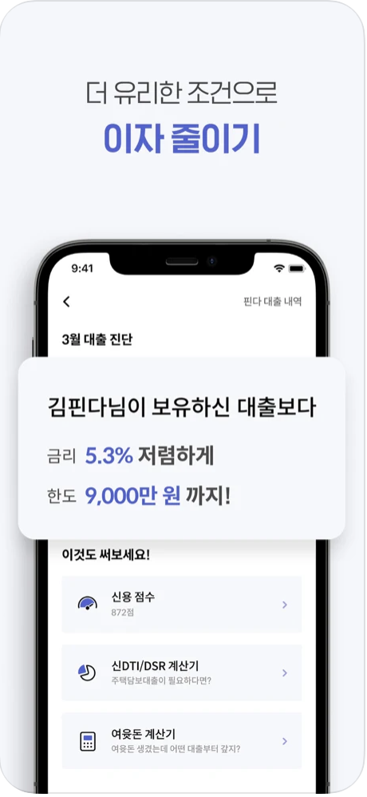 
- 소속: 핀다
- 기간: 2021.05 ~ 2021.08
- 역할: iOS 개발
- 개발환경: Xcode
- 사용기술: Swift, RxSwift, ReactorKit, Firebase, Moya, Xcodegen
- 대표 수행 업무:
  - 금융 스팸 차단 기능(두낫콜) 개발
    - 한번의 요청으로 41개의 금융사에 금융 스팸 차단 기능
  - 홈 개편
    - 전반적인 홈 디자인 변경
  
- 개선사항:
  - 테스트 가능한 아키텍처로 변경 후 팀원들에게 테스트 코드 관련 전파
  - 앱 특성상 디자이너가 특정 금융 상태일 때 디자인을 확인해야 하는 상황을 위해 특정한 앱 상태를 실행하는 데 너무 많은 시간이 소요됨에 따라 이를 해결하기 위해 바로 바로 특정 앱 상태들을 개발자가 모킹하여 디자이너가 쉽게 볼 수 있게 하는 기능 도입하여 생산성을 높임
- [해당 앱 스토어에서 보기](https://apps.apple.com/kr/app/%ED%95%80%EB%8B%A4-%EC%84%B8%EC%83%81%EC%97%90-%EC%97%86%EB%8D%98-%EB%8C%80%EC%B6%9C-%EB%B9%84%EA%B5%90-%ED%94%8C%EB%9E%AB%ED%8F%BC/id1494077875)

### 볼터치

- 소개: 동영상 리뷰 쇼핑 커머스
- 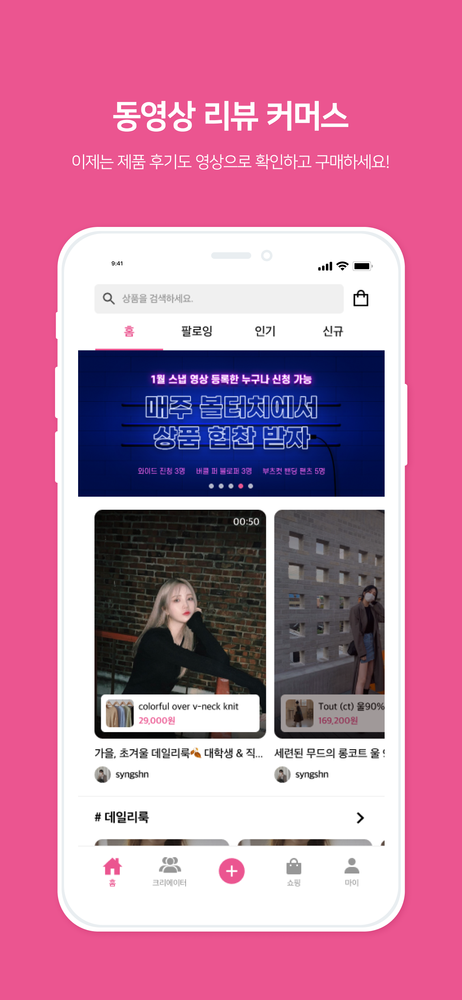 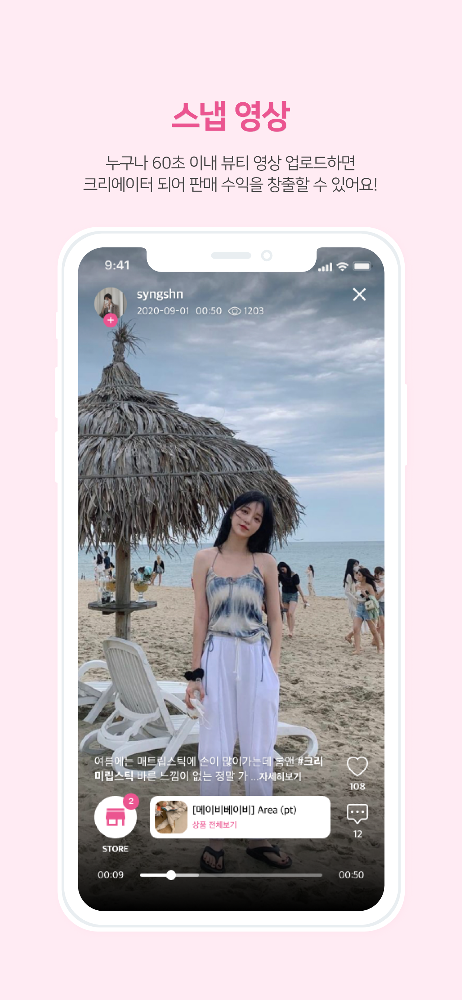 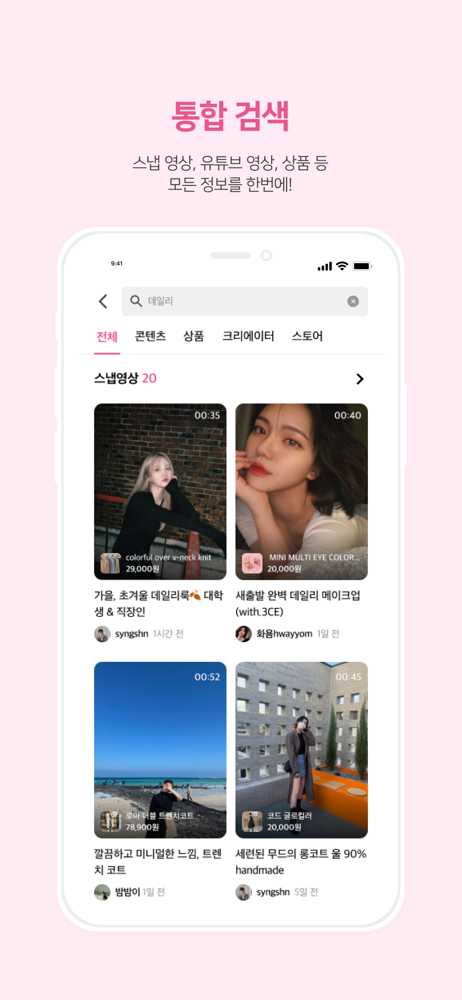 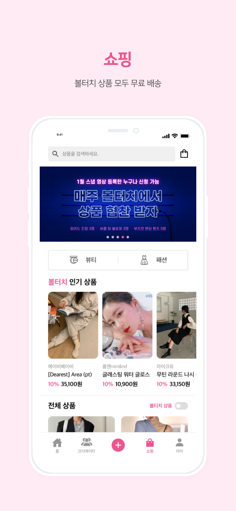 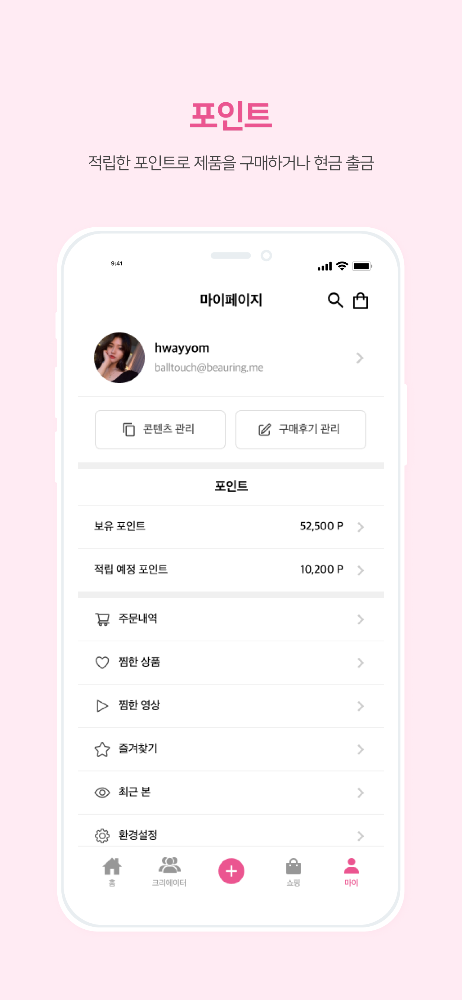
- 소속: 뷰링
- 기간: 2020.05 ~ 2021.05
- 역할: iOS 개발
- 개발환경: Xcode
- 사용기술: Swift, RxSwift, RIBs, Texture, ReactorKit, Firebase, Moya, R.swift, Xcodegen
- 대표 수행 업무:
  - 디자인 시스템 도입
  - 동영상 편집 기능 개발
  - 동영상 업로더 개발
  - 피드형 동영상 플레이어 개발
  - 유튜브 플레이어 개발
  - 크리에이터 SNS(피드, 팔로잉, 팔로워, 댓글, 대댓글) 개발
  - e-커머스(결제, 주문, 상품, 장바구니...etc) 개발
  - 통합 검색 개발
  - Deeplink, Deferred Deeplink 개발
  - Push 구축
  - 각종 analytics(firebase, facebook) 처리
 
- 개선사항:
  - 디자인 시스템을 도입하여 UI 개발 생산성을 비약적으로 향상, UI 공수 비용이 전에 비해 40% 이상 감소
  - 다이나믹 영상 다운로드 처리를 가능하게 하여, 미리 불러와야 할 영상을 전체 다운로드 하지 않고 일정 범위 만큼 다운로드 시켜 , 데이터 사용량을 대폭 감소, 미리 불러와야 할 영상 하나당,
    90% 데이터 사용량을 감소
  - 영상 캐쉬 처리를 통해 데이터 사용량을 대폭 감소 시켰고, 유저 리텐션이 7% 상승
  - Xcodegen 도입하여 자주 발생하는 프로젝트 설정 파일 충돌 문제 해결
  - fastlane을 사용하여 파이어베이스 앱 배포를 자동화
  - 모든 유틸리티는 유닛 테스트를 반드시 작성하였고, 테스트가 반드시 필요한 결제, 주문 기능에서는 단위 테스트, 통합 테스트를 작성하여 서비스의 안전을 높임
  - 코드 생산성과 일관성을 위해 코드 템플릿 제작, 생산성 30% 상승
- [해당 앱 스토어에서 보기](https://apps.apple.com/us/app/%EB%B3%BC%ED%84%B0%EC%B9%98-%EB%8F%99%EC%98%81%EC%83%81-%EB%A6%AC%EB%B7%B0-%EC%BB%A4%EB%A8%B8%EC%8A%A4/id1462665864)

### 아임홈

- 소개: 나만의 공간을 인테리어할 수 있는 앱, 인테리어 소품 배치, 공간의 도배 및 페인트 정보를 받을 수 있는 서비스
- 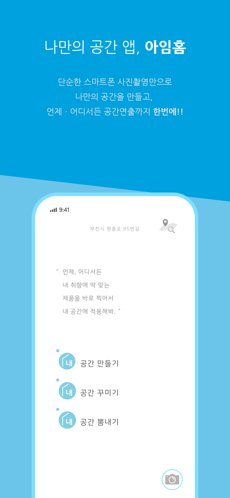 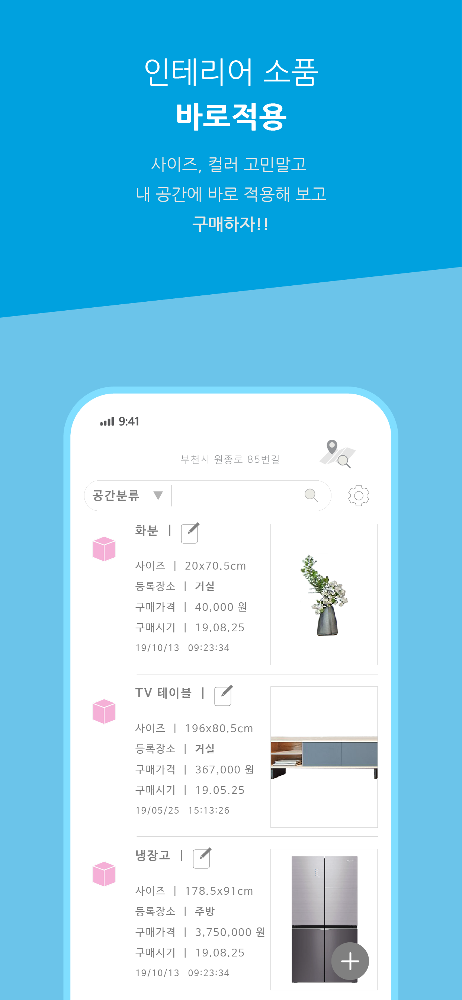 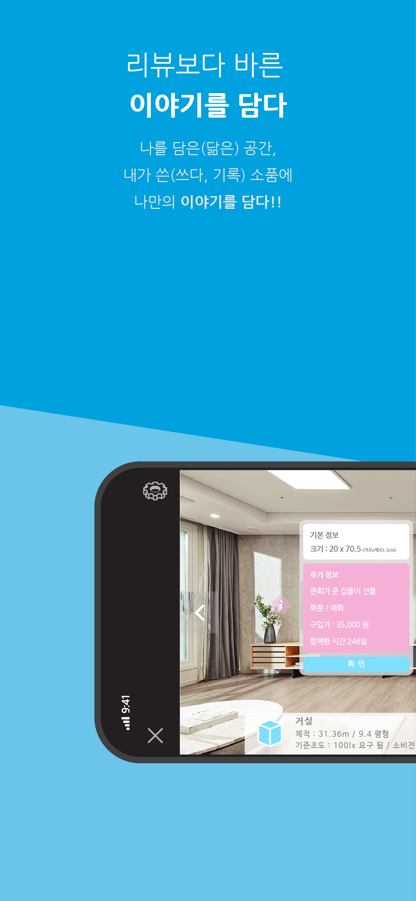 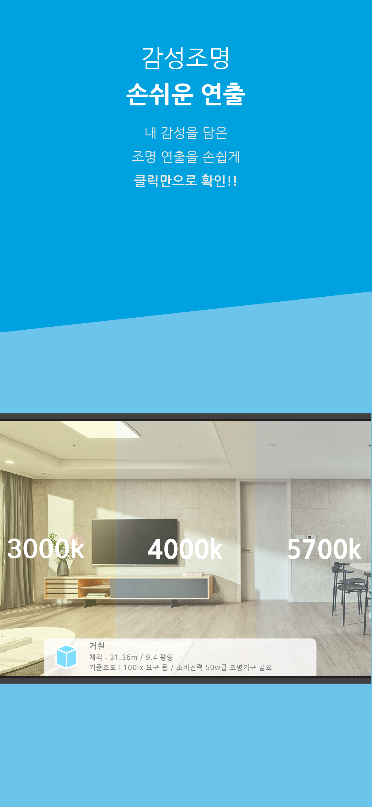 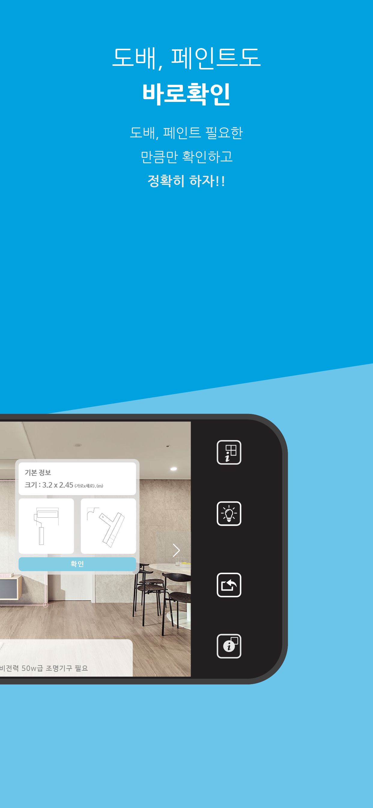
- 소속 : 누림
- 기간: 2020.01 ~ 2020.03
- 역할: iOS 개발
- 개발환경: Xcode
- 사용기술: Swift, RxSwift, SnapKit, RIBs, Texture, ReactorKit, Firebase, Moya, R.swift, TinyCrayon, Cocopods
- 대표 수행 업무:

  - Custom Camera 기능
  - 공간의 특정 영역 지정 시 도배, 페인트 정보 제공 기능
  - 이미지 평면화(3차원 이미지를 2차원으로 변경) 기능 (CamScanner와 동일한 기능)
  - 공간 Viewer 기능
  - 인테리어 사물 배치 기능
  - 조명 필터 긴능

- 개선사항:
  - Code로 UI 개발 시 AutoLayout과 StackView 보다 더 빠르고 수정이 쉬운 개발을 위해 Texture를  도입하였고 
      UI개발에 대한 작업 시간을 많이 단축
  - 각 계층 별 코드의 분리를 위해 RIBs를 도입
  - image, font 등을 불러올 때 수동으로 문자열을 작성하기 때문에 잘못 작성 시 크래쉬가 나는 상황을 줄이기 위해
    R.swift를 사용하여 build시에 image, font, colors, localizable string와 같은 것들을 자동으로 상수화 시키도록 하여 
    크래쉬를 없애 안전성을 높임

### 파스타

- 소개: 크로키 그리기 미술 교육 서비스
- 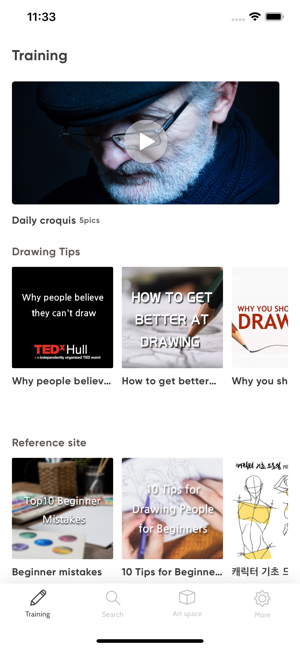 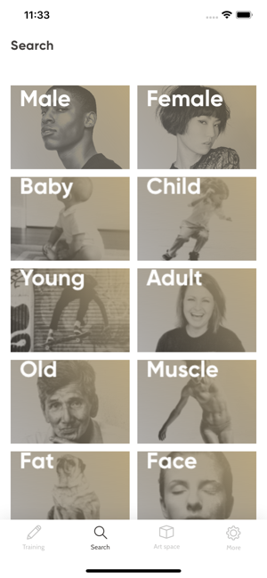 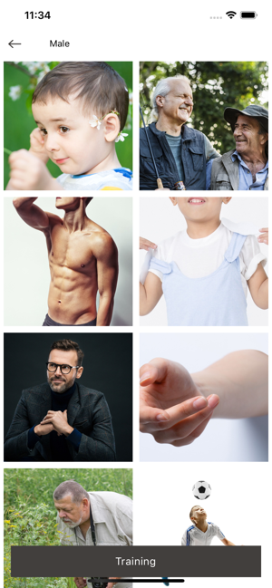 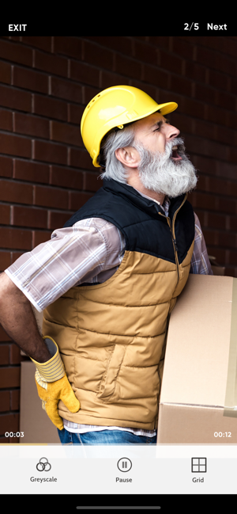 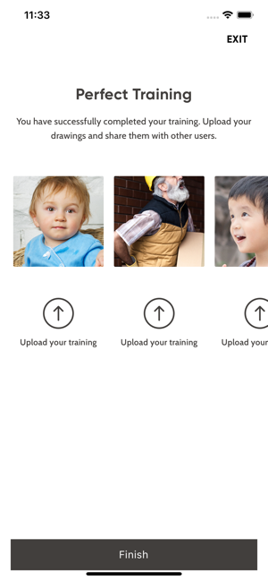
- 소속 : 누림
- 기간 : 2019.10 ~ 2019.12
- 역할: React Native(iOS, Android) 앱 개발
- 개발환경: Visual Studio Code
- 사용기술: react-navigation, redux, saga, firebase, axios, styled-components, react-native-iap
- 대표 수행 업무:

  - ios, android의 iap(인앱 결제) 기능
  - 구독되지 않은 회원이 크로키 player를 실행 시 구글 보상형 광고 활성화 기능
  - 미술 관련 유투브 영상 동영상 플레이 기능

- 성과: 와디즈 펀딩을 성공적으로 일정 내에 개발 및 배포
- 개선사항:
  - 앱의 State 공유를 많이 하는 상황이 오게 되면서, 기존 소스에 아키텍처가 없었기에 redux를 적용하여 앱의 State 공유를 쉽게 할 수 있도록 만들었습니다.
  - 기존 소스의 javascript를 typescript로 변환하여 type에 따른 버그들을 줄여 개발 시 안전성을 높였습니다.
- [AppStore](https://apps.apple.com/kr/app/fasta-croquis-and-drawing/id1445639082)

### 원미닛

- 소개: 원미닛은 자신만의 색깔과 스타일을 갖는 미니앱을 만들어 개인 및 기업이 자신들의 소식을 공유하고 사람들과 연결할 수 있는 플랫폼입니다.
- 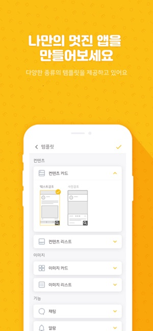   
- 소속 : 셀리
- 기간 : 2018.04 ~ 2019.06
- 역할: iOS 개발
- 개발환경: Xcode
- 사용기술: Swift, RxSwift, ReactorKit, SnapKit, PureDI, Moya, Hero, Google adb, Kingfisher, Cocoapods
- 수행업무:
  - 미니앱 스토어 개발
  - SNS, Blog, Image Gallery 템플릿 개발
  - 소셜 로그인(Facebook, Google) 로그인 구현
  - Google Native 광고 구현
  - 유지보수
- 개선사항:
  - ReactorKit을 도입하여 표준화된 아키텍처를 갖춰 향후 개발자 간의 커뮤니케이션을 높이고 PureDI를 도입하여 모듈 간의 독립성과 TDD가 용이한 구조로 만들어 유지 보수성을 높였습니다.
  - RxSwift를 도입하여 비동기 처리를 손쉽게 할 수 있도록 만들었습니다.
- [해당 앱 스토어에서 보기](https://apps.apple.com/kr/app/%EC%9B%90%EB%AF%B8%EB%8B%9B-1%EB%B6%84-%EC%95%88%EC%97%90-%EB%A7%8C%EB%93%9C%EB%8A%94-%EB%AA%A8%EB%B0%94%EC%9D%BC%EC%95%B1-1mean-it/id1445510118)

### 스마트불편신고

- 소개 : 서울특별시 시민들이 생활중에 느끼는 각종 불편사항을 스마트폰으로 언제, 어디서나 신고하여 민원처리를 할 수 있는 앱 입니다.
-  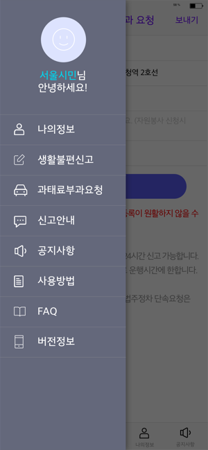 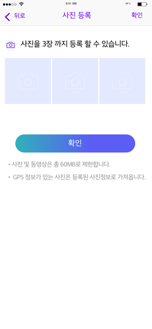 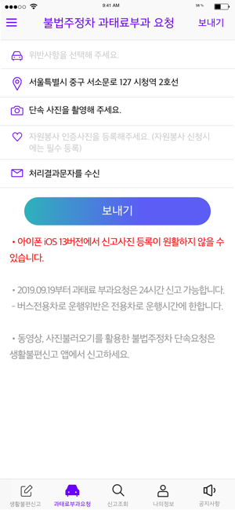
- 소속 : 그루기술
- 기간 : 2017.02 ~ 2018.02
- 내용 : iOS 개발 및 서비스
- 사용자 유저: 20만명
- 사용기술: Swift, NaverMaps
- 대표 수행 업무:
  - 차량 과태료 부과 신고 기능
  - 불편신고 기능 신고 기능
  - 유지보수
- 개선사항:
  - 기존 Objective-C 코드를 모두 Swift 코드로 이관하여 유지보수성을 높였습니다.
  - 당시 Slide Menu 라이브러리가 Swift로 구축된 라이브러리가 많이 없어, Swift를 사용하여 Slide Menu 라이브러리를 만들어 Swift를 사용하여 Slide Menu 라이브러리를 만들어 오픈 소스에 배포하였고, 실제 이 라이브러리를 프로젝트에 적용하였습니다.
- [AppStore](https://apps.apple.com/kr/app/%EC%84%9C%EC%9A%B8%EC%8A%A4%EB%A7%88%ED%8A%B8%EB%B6%88%ED%8E%B8%EC%8B%A0%EA%B3%A0/id547521233)

## 개인 프로젝트

### 중소기업 중앙회 임직원

- 소개 : 중소기업 중앙회 임직원 전용 수첩 앱
- 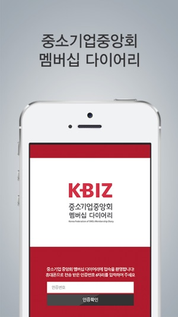 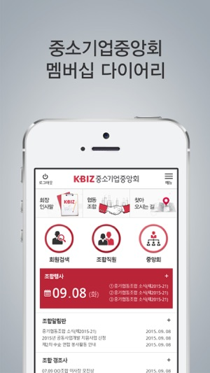s
- 소속 : 개인외주
- 기간 : 2016.11 ~ 2016.12
- 내용 : iOS 개발 및 서비스
- 참여도: 100%
- 사용기술: Objective-C, Swift
- 대표 수행 업무:
  - 하이브리드 앱 개발
  - Push 기능 개발
  - 유지보수
- [AppStore](https://apps.apple.com/kr/app/kbiz-%EC%A4%91%EC%86%8C%EA%B8%B0%EC%97%85%EC%A4%91%EC%95%99%ED%9A%8C-%ED%9A%8C%EC%9B%90%EC%88%98%EC%B2%A9/id1070529143)

 

## 오픈소스 활동

### SlideMenuController

- Slide Menu를 쉽게 만들 수 있는 라이브러리
- https://github.com/audrl1010/SlideMenuController

### EasyMakePhotoPicker

- 자신만의 PhotoPicker를 손쉽게 구축할 수 있게 해주는 라이브러리
- https://github.com/audrl1010/EasyMakePhotoPicker

### FluidAnchor

- AutoLayout Anchor를 손쉽게 사용할 수 있게 만들어주는 라이브러리
- https://github.com/audrl1010/FluidAnchor

### UIBaseKit

- 뷰의 구성 코드, 계층 코드, 제약조건 코드를 분리시켜 코드의 가독성을 높여주는 라이브러리
- https://github.com/audrl1010/UIBaseKit

### YoutubePlayerViewController

- 유투브 비디오 플레이어 라이브러리
- https://github.com/audrl1010/YoutubePlayerViewController

 

## 참여한 세미나
- AsyncSwift 2022 - 타다 RIB + 상태관리 redux, 29cm의 좋은 PR에 대한 소식
- Let`s Swift 판교 2차 - autolayout, frame에 대한 소식
- Let`s Swift 2019 - RIB에 대한 소식
- Let`s Swift 2018 - ReactorKit에 대한 소식
- Let`s Swift 2017 - RxSwift에 대한 소식

 

## 보유기술 및 사용가능 라이브러리

- Swift
- RxSwift, RxCocoa
- Architecture Framework(MVC, MVVM, ReactorKit, RIBs)
- Restful API Network(Alamofire, Moya)
- Image downloading and caching(Kingfisher)
- Autolayout(Code Base using SnapKit), storyboard
- UIKIt, Texture
- WebKit
- Firebase(analytics, adb, sms, push notification)
- naver SDK(map, login)
- kakao SDK(login)
- facebook SDK(login)
- google SDK(login, adb)
- airbridge, appsflyer, channel talk (analytics tool)
